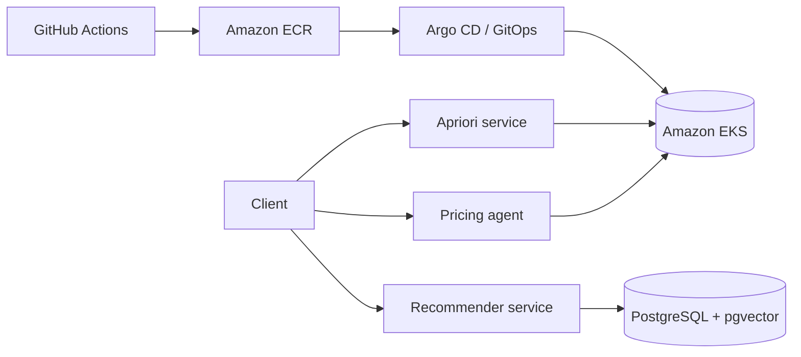

# Intelligent Mall System

This project modernizes a university mall discount-scheme system into a
cloud-native platform with three services: a pricing agent, an Apriori mining
service, and a recommender service.

## Architecture



## Services

The pricing agent exposes a FastAPI endpoint that accepts recent shop sales and
the current discount, then recommends a discount and estimates its reward.
Policy logic is isolated in `agents/pricing-agent/app/policy.py` so it can be
replaced by a trained RLlib policy later without changing the API contract.

This phase intentionally uses a lightweight Q-learning-inspired heuristic
instead of Ray RLlib, keeping local setup fast while preserving the service
boundary and response shape.

## Run locally

To run the web dashboard, three APIs, and PostgreSQL:

```powershell
Copy-Item .env.example .env
docker compose up --build
```

Open the dashboard at <http://127.0.0.1:5173>. The service documentation is
available at:

- Pricing agent: <http://127.0.0.1:8001/docs>
- Apriori service: <http://127.0.0.1:8002/docs>
- Recommender service: <http://127.0.0.1:8003/docs>

### Web dashboard (without Docker)

With the three backend services running, start the frontend development server:

```powershell
cd frontend
npm install
npm run dev
```

Open <http://127.0.0.1:5173>. The dashboard proxies its requests to the local
APIs; try Pricing Lab, Basket Insights, and Recommendations from the sidebar.

For development without Docker, create a Python 3.12 virtual environment and
install each service's `requirements.txt`.

Example request:

```powershell
Invoke-RestMethod `
  -Uri http://127.0.0.1:8000/generate-scheme `
  -Method Post `
  -ContentType "application/json" `
  -Body '{"shop_id":"shop-101","recent_sales":[100,110,125,140],"current_discount":10}'
```

## Test

```powershell
python -m pytest agents/pricing-agent/tests
python -m pytest apriori-service/tests
python -m pytest recommender-service/tests
```

## Cloud deployment configuration

The `terraform/`, `helm/`, `.github/workflows/`, `observability/`, and `mlops/`
directories contain deployment-ready templates for later phases. They do not
provision resources automatically. Configure AWS credentials, an OIDC trust
relationship for GitHub Actions, remote Terraform state, and a separate
`intelligent-mall-gitops` repository before applying them.

## Secrets and configuration

See [config/README.md](config/README.md). Local development uses an ignored
`.env`; GitHub Actions uses short-lived AWS credentials through OIDC; AWS
Secrets Manager or SSM supplies runtime secrets; and External Secrets Operator
projects those values into Kubernetes. No credential should be added to this
repository.
